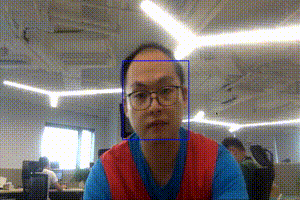

# Face Tracking Demo

Detect and track faces from a webcam (required).

### Image Detection for Real-Time Apps

We can lower detector requirements for real-time applications by heuristically or adaptively using tracking after we've obtained an initial set of bounding boxes from detection. 

Many modern deep learning detectors can be computationally expensive, and often times there is a tradeoff between precision and performance. Some of them rely on region proposal - this can result in detectors to be "jumpy" and appear to be unstable. 

For face detection in front of a webcam, we can run detector periodically, as the object of interest doesn't change semantically (still the same face), and then follow the trajectory of the face as it moves across the screen using trackers. 

In this demo, we use Blue and Green colored boxes to demonstrate detection / tracking to get a smooth trajectory of the bounding box as my face moves across the screen. 

Green = Detected face 

Blue = Box from previous detection, updated via tracking. 


### Pipeline

1. Run detector, get boxes (Green)
2. Track boxes for each frame (Blue)
3. Update detector periodically or on-demand, and re-create trackers for each box. 

## Install

`pip install -r requirements.txt`

## Run

Run main program, you should see webcam screen, with Green or Blue box for faces detected. 

Green = Detected face 

Blue = Box from previous detection, updated via tracking. 

````
python face_tracking.py`
````

Optionally use `-i` argument to set different detection intervals, in seconds. Default=6.

````
python face_tracking.py -i 3
````

## Sample




# LICENSE

MIT


